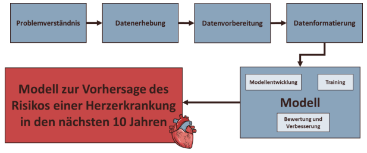

# Applied programming project

### **Background:** 
The present Framingham Heart Study Dataset comprises 4240 patient data, each with 15 features and the target variable. 
This outcome variable describes whether the patient is at risk for a heart disease in the next 10 years.

The 15 features include demographic characteristics such as gender and age, the patient's smoking habits, as well as 
medical characteristics such as blood pressure, medications and the heart rate.

**Dataset:**
https://www.kaggle.com/datasets/aasheesh200/framingham-heart-study-dataset

### **Goal:**
The aim of this project is to develop a machine learning model that makes a 
prediction of the risk of a heart disease in the next 10 years. This model is to be 
be developed with the help of a supervised machine learning method, a Random Forest.

## **Procedure:**
**1. Problem Understanding:**
The RKI states that one of the leading causes of death in Germany is cardiovascular disease. These cause about 40 % of all deaths. 
At the same time cardiovascular diseases lead to a reduction in the quality of life and generate high 
costs for the statutory health insurance funds [1].
Possible causes of heart disease are, for example, increasing age, an unhealthy lifestyle (smoking and lack of exercise) and high blood pressure [1]. 
high blood pressure [1]. Due to this, it is of high importance to assess the risk of patients for cardiovascular disease as early as possible so that it can be avoided. 
can be avoided. Thus, the quality of life of patients can be preserved and the costs of illness can be minimized.

**2. Data collection:**
Kaggle dataset: "Framingham Heart Study Dataset" → Open Data.
https://www.kaggle.com/datasets/aasheesh200/framingham-heart-study-dataset
The data come from the Framingham Heart Study, which has been in its third generation since 1948. The study is designed to identify the causes and risks 
of coronary heart disease. The study is one of the most important studies in the USA and the results of this study are now part of the medical standard [2].

**3. Data preparation:**
- Correct labeling of data.
- Data cleaning, reformatting and normalization.

**4. Data formatting:**
- Data must first be converted to the desired format.

**5. model development:**
Selection and testing of a supervised learning method:
- Random Forest
**Training**
The selected ML algorithm is to be trained with the data from the dataset. 
be trained.
**Evaluation and improvement**
Subsequently, the ML algorithm shall be evaluated for accuracy and performance. 
If the results are poor, these parameters should be improved by an adjustment of the hyperparameters or another 
machine learning method should be selected.

## **Features and target variable:**
**Demographic information:**
- Sex: male or female (Nominal, 1 or 0)
- Age: Age of the patient (Continuous)
- Education: no further information provided

**Behavioral:**
- Current Smoker: indicates whether or not the patient is a current smoker (Nominal, 1 or 0)
- Cigs Per Day: the number of cigarettes that the person smoked on average in one day (continuous)

**Information on medical history:**
- BP Meds: whether or not the patient was on blood pressure medication (Nominal, 1 or 0)
- Prevalent Stroke: whether or not the patient had previously had a stroke (Nominal, 1 or 0)
- Prevalent Hyp: whether or not the patient was hypertensive (Nominal, 1 or 0)
- Diabetes: whether or not the patient had diabetes (Nominal, 1 or 0)

**Information on current medical condition:**
- Tot Chol: total cholesterol level (Continuous)
- Sys BP: systolic blood pressure (Continuous)
- Dia BP: diastolic blood pressure (Continuous)
- BMI: Body Mass Index (Continuous)
- Heart Rate: heart rate (Continuous)
- Glucose: glucose level (Continuous)

**Target variable to predict:**
10 year risk of coronary heart disease (CHD) - (binary: “1”, means “Yes”, “0” means “No”)

### **Sources:**
[1] Robert-Koch-Institut (o. D.): Herz-Kreislauf-Erkrankungen, RKI - Themenschwerpunkt 
Herz-Kreislauf-Erkrankungen, [online] 
https://www.rki.de/DE/Content/Gesundheitsmonitoring/Themen/Chronische_Erkran
kungen/HKK/HKK_node.html [abgerufen am 27.10.2022].

[2] Wikipedia-Autoren (2004): Framingham-Herz-Studie, [online] 
https://de.wikipedia.org/wiki/Framingham-Herz-Studie [abgerufen am 27.10.2022].

[3] Pajankar, Ashwin/Aditya Joshi (2022): Hands-on Machine Learning with Python: 
Implement Neural Network Solutions with Scikit-learn and PyTorch, 1st ed., Apress.